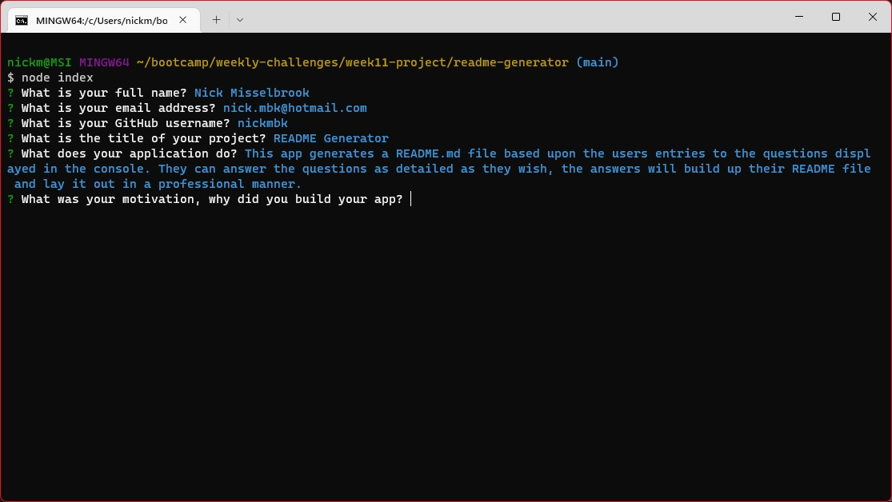

  # README Generator

  ## Description

  This app generates a README.md file based upon the users entries to the questions displayed in the console.  They can answer the questions as detailed as they wish, the answers will build up their README file and lay it out in a professional manner.

  I wanted to create this app so that users can save time when writing their README files.  They can take a little bit of time to write, especially if the user is new at markdown.  This app will produce a professional README file so the user can spend time on other tasks.

  This app uses JavaScript and Node JS, additionally it uses the Inquirer module for Node to accept user input and uses the fs module which is a built in module of Node for writing to the README file.  I used Node as I wanted this application to be run outside of the browser.

  I wanted to make the app a bit more advanced, for example asking the user if their were any contributors to the project, and if the user answers no, then the contributor section would be left out, otherwise if the user answered yes, they would be asked how many contributors and based from that answer they would be asked that many times for the contributors name and their GitHub username.  This proved difficult for me so decided to stick to the Minimum Viable Product and look at this later on.

  I have learnt more about how Node works and specifically Inquirer.  It's a little different working out of the browser as its a different environment, and some things that worked in JavaScript in the browser do not work in Node.

  As mentioned earlier, I would like to make the generator a bit more advanced, changing things within the file dependent on the users input, such as taking sections out if they don't need them.

  ## Table of Contents

  - [Installation](#installation)
  - [Usage](#usage)
  - [Credits](#credits)
  - [License](#license)
  - [Questions](#questions)

  ## Installation

  Download the code from the repo, by clicking on the repo link below, then clicking the green Code button and then Download Zip.  Unzip the file and open the terminal. Alternatively you can clone the repo to your system and open the terminal. In the terminal use the command `npm i` to install the dependancies. Once installed, run the command `node index`. This will run the application and you will be prompted with questions used to create your README file.

  Repo: [README Generator](https://www.github.com/nickmbk/readme-generator)

  ## Usage

  Each question will be displayed one at a time, awaiting your input before moving to the next question.
  
  The list of questions you will have will be: 
  - your full name 
  - your email address 
  - your github username 
  - the title of your project 
  - what does your application do? 
  - why did you build the app? 
  - what technologies did you use? 
  - what challenges did you face? 
  - what have you learnt 
  - are there any features you would like to add in the future? 
  - how to run/install the app? 
  - the URL for the app repo or deployed site 
  - step by step, how to use the app 
  - the filepath relevant to the README file to a screenshot 
  - names of contributors and their github accounts 
  - links to resources used 
  - select a license you have used 
  - how others can contribute to your project 
  - what tests users can run

  Once you have answered each question, press Enter on the keyboard to move to the next question.

  

  ## Credits

  ### Resources
  
  Inquirer Documentation https://github.com/SBoudrias/Inquirer.js

  ## License
  
  

  This project uses the MIT License.

  ## Questions

  Please contact me if you have any questions:

  Nick Misselbrook

  [nick.mbk@hotmail.com]nick.mbk@hotmail.com

  [GitHub: nickmbk](https://www.github.com/nickmbk)

  